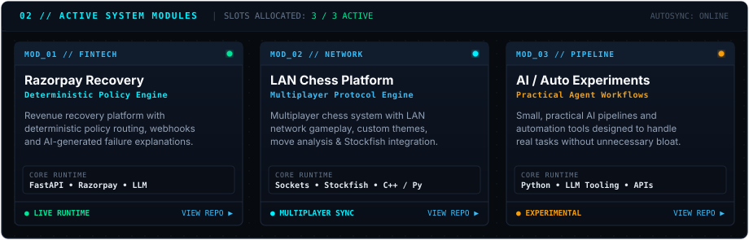
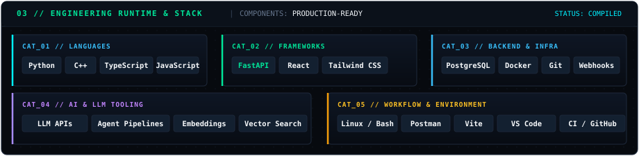
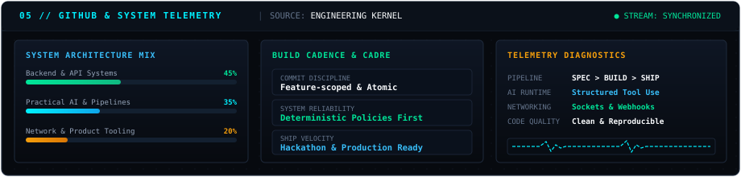
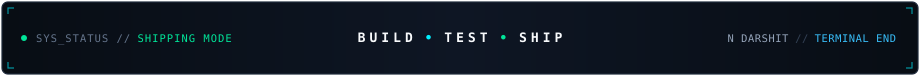

<div align="center">

<!-- ==================== 01 // HERO BANNER ==================== -->
<picture>
  <source media="(prefers-color-scheme: dark)" srcset="assets/hero-dark.svg">
  <source media="(prefers-color-scheme: light)" srcset="assets/hero-light.svg">
  
</picture>

<br>

<!-- Direct Action Dispatch Controls -->
<a href="https://github.com/darshitn"></a>
&nbsp;
<a href="https://linkedin.com/in/ndarshit"></a>
&nbsp;
<a href="https://darshit.dev"></a>
&nbsp;
<a href="mailto:contact@darshit.dev"></a>

</div>

<br>

---

### `02 // NOW BUILDING`

<picture>
  <source media="(prefers-color-scheme: dark)" srcset="assets/modules-dark.svg">
  <source media="(prefers-color-scheme: light)" srcset="assets/modules-light.svg">
  
</picture>

<br>

<table>
  <tr>
    <td width="33%" valign="top">
      <b><code>MOD_01</code> // Razorpay Recovery System</b><br><br>
      Automated revenue recovery engine designed to handle failed checkouts and payment drops via deterministic policy routing, webhook ingestion, and AI-generated explanations.<br><br>
      <code>Python</code> • <code>FastAPI</code> • <code>Razorpay APIs</code> • <code>LLM</code><br><br>
      <a href="https://github.com/darshitn/razorpay-recovery-system"><b>inspect source ↗</b></a>
    </td>
    <td width="33%" valign="top">
      <b><code>MOD_02</code> // LAN Chess Platform</b><br><br>
      High-performance multiplayer chess environment with local-network synchronization, custom themes, move history validation, and embedded Stockfish engine analysis.<br><br>
      <code>C++</code> • <code>Python</code> • <code>Sockets</code> • <code>Stockfish</code><br><br>
      <a href="https://github.com/darshitn/lan-chess"><b>inspect source ↗</b></a>
    </td>
    <td width="33%" valign="top">
      <b><code>MOD_03</code> // AI / Automation Pipeline</b><br><br>
      Practical micro-agent pipelines and developer workflows built to automate real tasks with deterministic validation and minimal overhead.<br><br>
      <code>Python</code> • <code>LLM Tooling</code> • <code>Docker</code> • <code>APIs</code><br><br>
      <a href="https://github.com/darshitn/ai-automation-experiments"><b>inspect source ↗</b></a>
    </td>
  </tr>
</table>

<br>

---

### `03 // ENGINEERING STACK`

<picture>
  <source media="(prefers-color-scheme: dark)" srcset="assets/stack-dark.svg">
  <source media="(prefers-color-scheme: light)" srcset="assets/stack-light.svg">
  
</picture>

<br>

| Classification | Technologies &amp; Tooling | Deployment Scope |
| :--- | :--- | :--- |
| **`LANGUAGES`** | `Python` &nbsp;•&nbsp; `C++` &nbsp;•&nbsp; `TypeScript` &nbsp;•&nbsp; `JavaScript` | System logic, network services, scripting, type-safe interfaces |
| **`FRAMEWORKS`** | `FastAPI` &nbsp;•&nbsp; `React` &nbsp;•&nbsp; `Tailwind CSS` | High-throughput APIs, reactive interfaces, modern design systems |
| **`BACKEND / INFRA`** | `PostgreSQL` &nbsp;•&nbsp; `Docker` &nbsp;•&nbsp; `Git` &nbsp;•&nbsp; `REST &amp; Webhooks` | Relational persistence, containerized environments, webhook pipelines |
| **`AI / DATA`** | `LLM Tooling` &nbsp;•&nbsp; `Agent Pipelines` &nbsp;•&nbsp; `Embeddings` &nbsp;•&nbsp; `Vector Search` | Structured outputs, deterministic agents, context retrieval |
| **`ENVIRONMENT`** | `Linux / Bash` &nbsp;•&nbsp; `Postman` &nbsp;•&nbsp; `Vite` &nbsp;•&nbsp; `VS Code` | POSIX toolchain, API testing, build optimization |

<br>

---

### `04 // SELECTED BUILDS`

```
INDEX // SOFTWARE PORTFOLIO REGISTER
```

| System Node | Architectural Purpose | Core Stack | Access Point |
| :--- | :--- | :--- | :--- |
| **Razorpay Recovery System** | Revenue recovery engine executing deterministic recovery policies on webhook events, paired with AI-driven failure analysis. | `FastAPI`, `Python`, `Razorpay API`, `LLM` | [`repo` ↗](https://github.com/darshitn/razorpay-recovery-system) |
| **LAN Chess Platform** | Low-latency local multiplayer chess game featuring real-time socket communication, board theming, and integrated Stockfish analysis. | `C++`, `Python`, `Sockets`, `Stockfish` | [`repo` ↗](https://github.com/darshitn/lan-chess) |
| **AI Task Orchestrator** | Experimental automation pipeline executing multi-step LLM tasks with fallback handling and structured output schemas. | `Python`, `LLM APIs`, `Docker`, `Git` | [`repo` ↗](https://github.com/darshitn/ai-automation-experiments) |
| **Backend Service Boilerplate** | Opinionated micro-backend template with async database pools, JWT auth, health probes, and structured error responses. | `FastAPI`, `PostgreSQL`, `Docker`, `Pytest` | [`repo` ↗](https://github.com/darshitn/backend-service-template) |

<br>

---

### `05 // GITHUB TELEMETRY`

<picture>
  <source media="(prefers-color-scheme: dark)" srcset="assets/telemetry-dark.svg">
  <source media="(prefers-color-scheme: light)" srcset="assets/telemetry-light.svg">
  
</picture>

<br>

- **Build Discipline**: Atomic commits, branch-tested features, reproducible dependencies.
- **Architecture Priority**: Deterministic backend policies backed by pragmatic AI augmentation.
- **Execution Ethos**: Building and shipping operational software over collecting certificates.

<br>

---

### `06 // CURRENT FOCUS`

```
RADAR // ACTIVE ENGINEERING OBJECTIVES
```

- `[01]` **AI Systems & Agents** — Designing robust agents with deterministic fallback rails and strict JSON schemas.
- `[02]` **Backend Concurrency** — Deepening knowledge in asynchronous architectures, connection pooling, and webhook reliability.
- `[03]` **Software Craftsmanship** — Writing clean, maintainable C++ and Python with thorough error containment.
- `[04]` **Hackathons & Shipping** — Prototyping under tight constraints and deploying software that solves concrete problems.

<br>

---

<picture>
  <source media="(prefers-color-scheme: dark)" srcset="assets/footer-dark.svg">
  <source media="(prefers-color-scheme: light)" srcset="assets/footer-light.svg">
  
</picture>

<div align="center">
  <br>
  <sub><b>N DARSHIT</b> • B.Tech CSE (Y2) • <a href="https://linkedin.com/in/ndarshit">LinkedIn</a> • <a href="https://darshit.dev">Portfolio</a> • <a href="https://github.com/darshitn">GitHub</a> • <a href="mailto:contact@darshit.dev">Email</a></sub>
</div>
